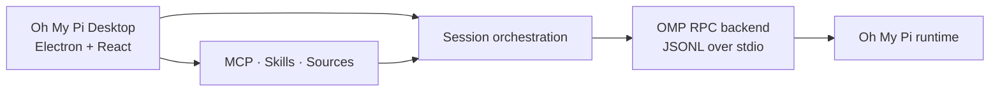

<div align="center">
  
  <h1>Oh My Pi Desktop</h1>
  <p><strong>A visual, local-first desktop shell for Oh My Pi.</strong></p>
  <p>Bring terminal-grade agent work into a durable desktop workspace with sessions, tools, models, permissions, and long-running tasks you can see and control.</p>

  <p>
    <a href="https://github.com/BRCOO/ohmypi-craft/actions/workflows/release-electron.yml"></a>
    <a href="LICENSE"></a>
    <a href="https://github.com/BRCOO/ohmypi-craft/stargazers"></a>
    <a href="https://github.com/BRCOO/ohmypi-craft/issues"></a>
  </p>

  <p>
    <a href="README.zh-CN.md">中文文档</a> ·
    <a href="https://ohmypi.com">Website</a> ·
    <a href="CONTRIBUTING.md">Contributing</a> ·
    <a href="SECURITY.md">Security</a>
  </p>
</div>

> **Status: active development.** Oh My Pi Desktop is an evolving open-source project. APIs, packaging, and provider integrations may change while the desktop shell reaches release quality.

## Why Oh My Pi Desktop?

Oh My Pi is powerful in the terminal. Oh My Pi Desktop gives that workflow a visual home without hiding the parts developers need to trust:

- **See the work** — stream agent output, tool calls, plans, files, diffs, and diagnostics in one place.
- **Keep sessions durable** — organize parallel work in a multi-session workspace instead of losing context in terminal tabs.
- **Stay in control** — choose permission modes, models, providers, sources, skills, and MCP tools explicitly.
- **Run locally first** — the desktop shell and OMP runtime are designed around local workspaces and inspectable state.
- **Scale the workflow** — use the Electron desktop app for daily work or the headless server/CLI surfaces for automation and remote execution.

## What is included

| Capability | What it provides |
| --- | --- |
| Multi-session inbox | Durable sessions, status workflow, flags, search, and session actions |
| OMP RPC backend | A typed bridge from the desktop shell to the Oh My Pi runtime over stdio |
| Model control | Provider onboarding, model discovery, model selection, and per-session control |
| Permission modes | Explore, Ask to Edit, and Auto-style workflows with visible state |
| Sources and tools | MCP servers, REST/API sources, local files, Skills, and Agents management |
| Visual agent loop | Streaming messages, tool cards, plans, todos, diffs, and extension UI requests |
| Cross-platform packaging | GitHub Actions release pipeline for macOS, Windows, and Linux artifacts |

## How it works



The desktop app owns the workspace, session history, permissions, and presentation layer. Oh My Pi remains the agent runtime. The OMP backend translates runtime frames into typed desktop events and keeps session state synchronized.

## Quick start

### Prerequisites

- [Bun 1.3.14](https://bun.sh/) (the version used by CI)
- Git
- Node.js 18+ for auxiliary tooling

### Run from source

```bash
git clone https://github.com/BRCOO/ohmypi-craft.git
cd ohmypi-craft
bun install
bun run electron:dev
```

For a production-like local build:

```bash
bun run electron:start
```

Provider credentials and integrations are configured from the app. Keep local secrets in `.env` or the OS credential store; never commit them.

## Development commands

```bash
# Fast pre-commit gate
bun run quality:quick

# Full verification gate
bun run quality:verify

# Type checks and tests
bun run typecheck:all
bun test

# Electron development server
bun run electron:dev
```

Release and smoke-test documentation lives in [`docs/superpowers/`](docs/superpowers/), including the [multi-platform release guide](docs/superpowers/github-actions-multiplatform-release.md).

## Repository layout

```text
apps/electron/              Desktop application: main, preload, renderer, assets
apps/cli/                   Headless/server CLI surface
apps/viewer/                Session viewer surface
apps/webui/                 Browser-facing headless UI
packages/core/              Shared domain types
packages/shared/            Agent backends, config, auth, sources, sessions
packages/server-core/       Session orchestration and runtime services
packages/pi-agent-server/   Pi/OMP runtime bridge
packages/ui/                Shared UI primitives
scripts/                    Build, quality, release, and smoke-test tooling
docs/                       Architecture decisions and release operations
```

## Supported release targets

The release workflow builds:

- macOS: Apple Silicon and Intel
- Windows: x64
- Linux: x64

Unsigned local artifacts are supported for development. Production signing and notarization are optional CI capabilities configured through repository secrets.

## Privacy and security

Oh My Pi Desktop is built for local-first agent work. Workspace data and credentials are handled by the local application layers; remote server mode is opt-in and protected by an explicit token. Read [`SECURITY.md`](SECURITY.md) before reporting a vulnerability, and do not include API keys, credentials, or private workspace data in issues.

## Contributing

Bug reports, feature ideas, documentation improvements, and focused code contributions are welcome. Start with [`CONTRIBUTING.md`](CONTRIBUTING.md), then use the repository templates for [bug reports](.github/ISSUE_TEMPLATE/bug_report.yml), [feature requests](.github/ISSUE_TEMPLATE/feature_request.yml), and pull requests.

## License and attribution

Oh My Pi Desktop is released under the [Apache License 2.0](LICENSE).

This repository contains code derived from the Craft Agents open-source project. See [`NOTICE`](NOTICE) and [`TRADEMARK.md`](TRADEMARK.md) for attribution and trademark guidance. Oh My Pi is an independent project and is not endorsed by Craft Docs Ltd.

If this project helps your workflow, a star is the simplest way to support it. Issues and concrete feedback are even more valuable while the release surface is being hardened.
