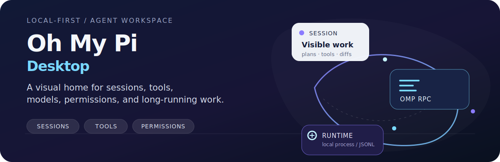
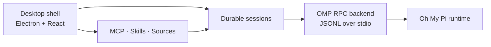

<p align="center">
  
</p>

<p align="center">
  <a href="https://github.com/BRCOO/ohmypi-craft/releases/latest"></a>
  <a href="LICENSE"></a>
  <a href="https://github.com/BRCOO/ohmypi-craft/stargazers"></a>
  <a href="https://github.com/BRCOO/ohmypi-craft/issues"></a>
</p>

<p align="center">
  <a href="https://github.com/BRCOO/ohmypi-craft/releases/latest">Download</a> ·
  <a href="README.zh-CN.md">中文文档</a> ·
  <a href="CONTRIBUTING.md">Contributing</a> ·
  <a href="SECURITY.md">Security</a>
</p>

> **Status: active development.** Oh My Pi Desktop is an evolving open-source project. APIs, packaging, and provider integrations may change while the desktop shell reaches release quality.

## Download

Grab the latest packages from the [GitHub Releases page](https://github.com/BRCOO/ohmypi-craft/releases/latest):

| Platform | Package |
| --- | --- |
| macOS | Apple Silicon and Intel `.dmg` / `.zip` |
| Windows | x64 NSIS installer `.exe` |
| Linux | x64 `.AppImage` |

Current packages are unsigned. On macOS, Gatekeeper may require an explicit confirmation; on Windows, SmartScreen may show a warning. Verify the downloaded file with the attached `SHA256SUMS.txt` before launching it.

## What is Oh My Pi Desktop?

Oh My Pi Desktop is a visual, local-first workspace for [Oh My Pi](https://github.com/can1357/oh-my-pi). It brings terminal-grade agent work into a durable desktop surface where sessions, tools, models, permissions, and long-running tasks stay visible and recoverable.

The desktop shell owns the workspace and presentation layer. The Oh My Pi runtime remains the execution layer, connected through a typed JSONL RPC bridge.

## What you can see and control

- **Durable sessions** — organize parallel work with status, search, flags, and session actions.
- **The complete agent loop** — inspect streamed messages, tool calls, plans, todos, diffs, and diagnostics.
- **Explicit permissions** — choose how much autonomy a session has instead of hiding the boundary.
- **Models and providers** — onboard providers, discover models, and control configuration per session.
- **Sources and tools** — manage MCP servers, REST/API sources, local files, Skills, and Agents.
- **Desktop or headless workflows** — use Electron for daily work, or the server/CLI surfaces for automation and remote execution.

## How it works



The UI keeps session state, permissions, and presentation coherent while the RPC backend translates runtime frames into typed desktop events. This separation keeps the runtime inspectable and the visual layer replaceable.

## Quick start from source

### Prerequisites

- [Bun 1.3.14](https://bun.sh/) — the version used by CI
- Git
- Node.js 18+ for auxiliary tooling

### Run the desktop app

```bash
git clone https://github.com/BRCOO/ohmypi-craft.git
cd ohmypi-craft
bun install
bun run electron:dev
```

For a production-like local build:

```bash
bun run electron:start
```

Configure provider credentials and integrations from the app or your local environment. Keep secrets in `.env` or the OS credential store; never commit them.

## Development commands

```bash
# Fast pre-commit gate
bun run quality:quick

# Full verification gate
bun run quality:verify

# Type checks and tests
bun run typecheck:all
bun test
```

For the CLI surface, see [`docs/cli.md`](docs/cli.md). Release and smoke-test procedures live in [`docs/release.md`](docs/release.md).

## Supported release targets

- macOS: Apple Silicon and Intel
- Windows: x64
- Linux: x64

The release workflow packages a pinned Oh My Pi runtime for each target. Signing and notarization are optional CI capabilities configured through repository secrets.

## Repository layout

```text
apps/electron/              Desktop application: main, preload, renderer, assets
apps/cli/                   Headless/server CLI surface
apps/viewer/                Session viewer surface
apps/webui/                 Browser-facing headless UI
packages/core/              Shared domain types
packages/shared/            Agent backends, config, auth, sources, sessions
packages/server-core/       Session orchestration and runtime services
packages/pi-agent-server/   Pi/OMP runtime bridge
packages/ui/                Shared UI primitives
scripts/                    Build, quality, release, and smoke-test tooling
docs/                       Public CLI and release documentation
```

## Privacy and security

Oh My Pi Desktop is built for local-first agent work. Workspace data and credentials are handled by local application layers; remote server mode is opt-in and protected by an explicit token. Review [`SECURITY.md`](SECURITY.md) before reporting a vulnerability, and never include API keys, credentials, or private workspace data in issues.

## Contributing

Bug reports, feature ideas, documentation improvements, and focused code contributions are welcome. Start with [`CONTRIBUTING.md`](CONTRIBUTING.md), then use the repository templates for [bug reports](.github/ISSUE_TEMPLATE/bug_report.yml), [feature requests](.github/ISSUE_TEMPLATE/feature_request.yml), and pull requests.

## License and attribution

Oh My Pi Desktop is released under the [Apache License 2.0](LICENSE).

This repository contains code derived from the Craft Agents open-source project. See [`NOTICE`](NOTICE) and [`TRADEMARK.md`](TRADEMARK.md) for attribution and trademark guidance. Oh My Pi is an independent project and is not endorsed by Craft Docs Ltd.

If this project helps your workflow, a star is the simplest way to support it. Issues and concrete feedback are even more valuable while the release surface is being hardened.
