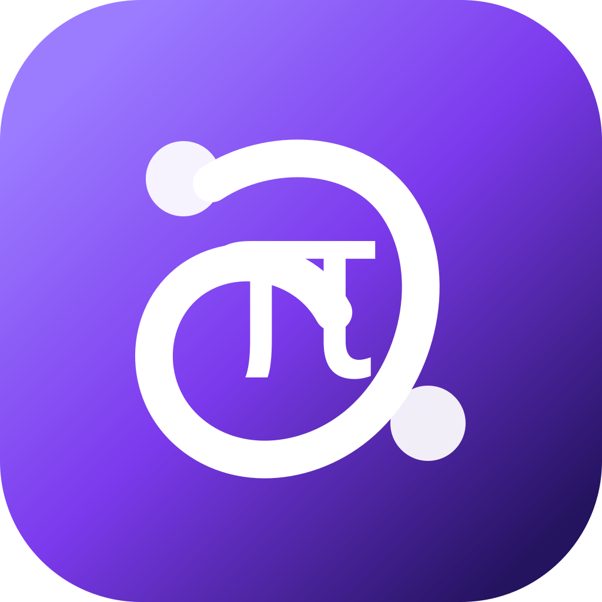

<div align="center">
  
  <h1>Oh My Pi Desktop</h1>
  <p><strong>Oh My Pi 的可视化、本地优先桌面工作台。</strong></p>
  <p>把终端级 Agent 工作带入一个持久化桌面空间：会话、工具、模型、权限和长任务都可见、可控、可恢复。</p>

  <p>
    <a href="README.md">English</a> ·
    <a href="https://ohmypi.com">官网</a> ·
    <a href="CONTRIBUTING.md">参与贡献</a> ·
    <a href="SECURITY.md">安全策略</a>
  </p>
</div>

> **状态：积极开发中。** 桌面 API、打包方式和 Provider 集成仍可能变化。

## 它解决什么问题

Oh My Pi 擅长终端里的 Agent 工作流，Oh My Pi Desktop 为它补上一个可视化外壳：

- 多会话工作区：并行任务不会散落在终端标签页里；
- 可视化 Agent 循环：消息、工具调用、计划、Todo、Diff 和诊断集中展示；
- 显式控制：模型、Provider、权限模式、Sources、Skills 和 MCP 工具可控；
- 本地优先：围绕本地工作区和可检查状态构建；
- 桌面与无头模式：日常使用 Electron，自动化和远程执行可使用 Server/CLI。

## 快速开始

需要 [Bun 1.3.14](https://bun.sh/)、Git 和 Node.js 18+：

```bash
git clone https://github.com/BRCOO/ohmypi-craft.git
cd ohmypi-craft
bun install
bun run electron:dev
```

生产化本地运行：

```bash
bun run electron:start
```

## 常用检查

```bash
bun run quality:quick
bun run quality:verify
bun run typecheck:all
bun test
```

## 项目结构

```text
apps/electron/              Electron 桌面应用
apps/cli/                   Server/CLI 入口
apps/viewer/                会话查看器
apps/webui/                 无头模式 Web UI
packages/shared/            Agent Backend、配置、认证、Sources、Sessions
packages/server-core/       会话编排和运行时服务
packages/pi-agent-server/   Pi/OMP 运行时桥接
packages/ui/                共享 UI 组件
scripts/                    构建、发布和 Smoke Test 工具
docs/                       公共 CLI 和发布文档
```

## 贡献与许可证

请先阅读 [`CONTRIBUTING.md`](CONTRIBUTING.md)。项目采用 [Apache License 2.0](LICENSE)。仓库包含源自 Craft Agents 开源项目的代码，归属和商标说明见 [`NOTICE`](NOTICE) 与 [`TRADEMARK.md`](TRADEMARK.md)。Oh My Pi 是独立项目，并不代表 Craft Docs Ltd. 的官方产品或背书。
