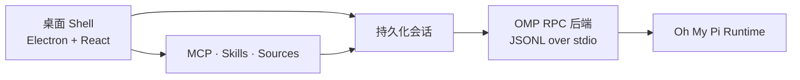

<p align="center">
  
</p>

<p align="center">
  <a href="https://github.com/BRCOO/ohmypi-craft/releases/latest"></a>
  <a href="LICENSE"></a>
  <a href="https://github.com/BRCOO/ohmypi-craft/stargazers"></a>
</p>

<p align="center">
  <a href="README.md">English</a> ·
  <a href="https://github.com/BRCOO/ohmypi-craft/releases/latest">下载最新版本</a> ·
  <a href="CONTRIBUTING.md">参与贡献</a> ·
  <a href="SECURITY.md">安全策略</a>
</p>

> **状态：积极开发中。** 桌面 API、打包方式和 Provider 集成仍可能变化。

## 下载

前往 [GitHub Releases](https://github.com/BRCOO/ohmypi-craft/releases/latest) 获取最新安装包：

| 平台 | 安装包 |
| --- | --- |
| macOS | Apple Silicon 与 Intel 的 `.dmg` / `.zip` |
| Windows | x64 NSIS 安装器 `.exe` |
| Linux | x64 `.AppImage` |

当前安装包尚未签名。macOS Gatekeeper 或 Windows SmartScreen 可能会显示安全提示；启动前请使用 Release 中附带的 `SHA256SUMS.txt` 校验文件。

## Oh My Pi Desktop 是什么

Oh My Pi Desktop 是 [Oh My Pi](https://github.com/can1357/oh-my-pi) 的本地优先可视化工作台。它把终端级 Agent 工作带入一个持久化桌面空间，让会话、工具、模型、权限和长任务始终可见、可恢复。

桌面 Shell 负责工作区和展示层，Oh My Pi Runtime 负责执行；两者通过类型化的 JSONL RPC 桥接通信。

## 你可以看到和控制什么

- **持久化会话**：组织并行任务，支持状态、搜索、标记和会话操作；
- **完整 Agent 循环**：查看消息流、工具调用、计划、Todo、Diff 和诊断；
- **显式权限控制**：明确每个会话的自动化边界；
- **模型与 Provider**：配置 Provider、发现模型，并按会话控制模型；
- **Sources 与工具**：管理 MCP Server、REST/API Source、本地文件、Skills 和 Agents；
- **桌面与无头模式**：日常使用 Electron，自动化和远程执行可使用 Server/CLI。

## 工作方式



## 从源码运行

### 环境要求

- [Bun 1.3.14](https://bun.sh/)
- Git
- Node.js 18+

### 启动桌面应用

```bash
git clone https://github.com/BRCOO/ohmypi-craft.git
cd ohmypi-craft
bun install
bun run electron:dev
```

生产化本地运行：

```bash
bun run electron:start
```

Provider 凭证和集成配置在应用内或本地环境中完成。请将密钥放在 `.env` 或系统凭证存储中，绝不要提交到仓库。

## 常用检查

```bash
bun run quality:quick
bun run quality:verify
bun run typecheck:all
bun test
```

CLI 文档见 [`docs/cli.md`](docs/cli.md)，发布和 Smoke Test 流程见 [`docs/release.md`](docs/release.md)。

## 支持的平台

- macOS：Apple Silicon、Intel
- Windows：x64
- Linux：x64

## 项目结构

```text
apps/electron/              Electron 桌面应用
apps/cli/                   Server/CLI 入口
apps/viewer/                会话查看器
apps/webui/                 无头模式 Web UI
packages/core/              共享领域类型
packages/shared/            Agent Backend、配置、认证、Sources、Sessions
packages/server-core/       会话编排和运行时服务
packages/pi-agent-server/   Pi/OMP 运行时桥接
packages/ui/                共享 UI 组件
scripts/                    构建、发布和 Smoke Test 工具
docs/                       公共 CLI 和发布文档
```

## 贡献、隐私与许可证

请先阅读 [`CONTRIBUTING.md`](CONTRIBUTING.md)。项目采用 [Apache License 2.0](LICENSE)。漏洞请按照 [`SECURITY.md`](SECURITY.md) 的私密流程报告，不要在公开 Issue 中提交 API Key、凭证或工作区数据。

仓库包含源自 Craft Agents 开源项目的代码，归属和商标说明见 [`NOTICE`](NOTICE) 与 [`TRADEMARK.md`](TRADEMARK.md)。Oh My Pi 是独立项目，并不代表 Craft Docs Ltd. 的官方产品或背书。
