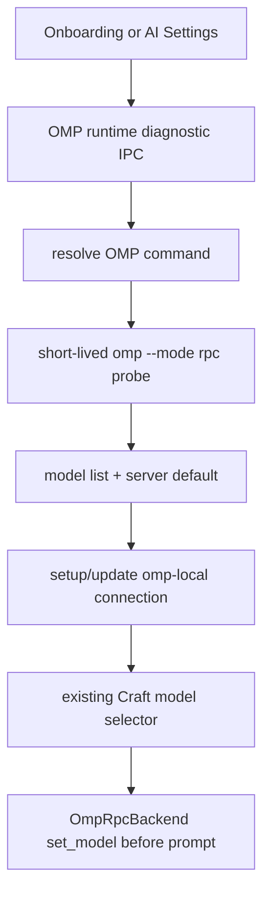

# OMP product hardening phase 1

Date: 2026-07-05

## Status

Direction approved. This spec defines the first product-hardening slice before implementation.

## Objective

Move the OMP integration from a technically working Alpha/MVP to an internally usable product path. The first hardening slice should make OMP setup, diagnostics, model refresh, and Windows development builds predictable enough that a developer who did not build the integration can install, configure, diagnose, and use it.

This phase intentionally keeps the current Craft shell and OMP RPC backend architecture. It does not start the full rebrand or rich OMP extension UI work.

## Current state

The branch already has:

- an `OmpRpcBackend` that launches `omp --mode rpc`;
- RPC model discovery through `get_available_models` and `get_state`;
- provider-qualified OMP model ids such as `deepseek/deepseek-v4-flash`;
- an onboarding card that creates an `omp-local` connection and lets the existing model selector display OMP models.

The remaining maturity gaps are operational:

- Electron build scripts are fragile on Windows paths containing spaces, as seen under `D:\ALL PROJECT\ohmypi-craft`;
- OMP runtime setup can still fail late or generically when the `omp` command is missing, stale, slow, or misconfigured;
- the UI does not yet expose a clear OMP health/status/configuration surface after onboarding;
- the validation path is mostly manual, so regressions in build/startup/model-refresh can slip through.

## Selected approach

Implement a narrow "product hardening" layer around the existing OMP backend.

Compared with a broad product rewrite, this keeps risk small: the backend and model selector keep their current contracts, while setup, diagnostics, and verification become more user-friendly and repeatable.

## Non-goals

- Full Oh My Pi rebrand of all Craft screens.
- Full `extension_ui_request` parity for select/input/confirm/custom panels.
- Direct SDK embedding of `@oh-my-pi/pi-coding-agent`.
- Packaging/signing/release-channel work.
- Replacing Craft's existing `anthropic`, `pi`, or local-model flows.

## Design

### 1. Windows build reliability

The first build target is the path that already failed during smoke testing: `bun run electron:build:main` in a workspace path containing spaces.

Implementation direction:

- Replace shell-sensitive `bun run esbuild ...` invocations in `scripts/electron-build-main.ts` with a safer direct invocation.
- Prefer using the esbuild JavaScript API or a resolved executable path plus argument array. Avoid command strings that can be reparsed by a shell.
- Keep the existing build outputs:
  - `apps/electron/dist/main.cjs`
  - `apps/electron/dist/interceptor.cjs`
  - `packages/messaging-whatsapp-worker/dist/worker.cjs`
- Preserve existing external/alias behavior for Electron, Claude SDK, Telegram polyfills, and optional WhatsApp dependencies.

Acceptance:

- `bun run electron:build:main` succeeds from `D:\ALL PROJECT\ohmypi-craft`.
- `node --check apps/electron/dist/main.cjs` passes.
- The change does not require renaming the workspace folder.

### 2. OMP runtime diagnostics

Add an explicit OMP runtime diagnostic layer rather than letting generic spawn/model-refresh errors leak to onboarding.

Proposed module:

```text
packages/shared/src/agent/backend/omp/omp-diagnostics.ts
```

Core API shape:

```ts
type OmpCommandSource = 'config' | 'env' | 'path-default'

interface OmpRuntimeStatus {
  ok: boolean
  command: string
  source: OmpCommandSource
  modelCount?: number
  serverDefault?: string
  errorCode?: 'command_not_found' | 'spawn_error' | 'rpc_timeout' | 'unexpected_exit' | 'empty_model_list' | 'unknown'
  message?: string
  detail?: string
}
```

Command resolution order:

1. persisted config value, `ompCommandPath`;
2. `OMP_COMMAND` environment variable;
3. default command name, `omp`.

The probe should use the same RPC path the backend uses: start `omp --mode rpc`, wait for readiness, request available models/state, and shut down the short-lived child process. Do not depend on a separate `omp --version` command unless OMP upstream guarantees it later.

Error messages should be actionable:

- command not found: "Install Oh My Pi or set the OMP command path."
- spawn error: include the command and short OS error.
- RPC timeout: tell the user the command launched but did not become RPC-ready.
- empty model list: tell the user OMP started but returned no usable models.

### 3. Persisted OMP command path

Mirror the existing Git Bash path pattern in `packages/shared/src/config/storage.ts`.

Add:

- `getOmpCommandPath(): string | undefined`
- `setOmpCommandPath(path: string): boolean`
- `clearOmpCommandPath(): void`

The OMP backend, model discovery, and diagnostics should all read through the same command resolver. This prevents onboarding, settings, and real sessions from disagreeing about which OMP binary is being used.

### 4. Setup/onboarding hardening

The OMP onboarding card should not create a false-success connection when OMP is missing or cannot start.

Setup flow:

```text
Click Oh My Pi / OMP
  -> run OMP runtime probe
  -> if probe fails: stay on provider-select and show actionable error
  -> if probe succeeds:
       create/update omp-local connection
       persist discovered models and server default
       set omp-local as default when appropriate
       complete onboarding
```

Server-side setup should treat OMP differently from generic refreshable providers:

- For `providerType: 'omp'`, model discovery failure during initial setup is a setup failure, not just a warning.
- Failed setup should not leave a new default `omp-local` connection behind.
- Existing `omp-local` updates may preserve the previous working model list when a manual refresh fails, but the UI must report the refresh failure.

### 5. Settings surface

Add a minimal OMP status/configuration surface in the existing AI settings area.

The card should show:

- resolved OMP command;
- command source: saved path, environment variable, or PATH default;
- runtime status: ready, missing, timeout, failed, or unchecked;
- model count and server default when ready;
- actions:
  - "Check OMP"
  - "Refresh models"
  - "Set command path"
  - "Clear saved path"

This should reuse existing settings components where possible. It should not introduce a separate settings architecture.

### 6. Model refresh behavior

OMP model refresh should keep the current dynamic model system but improve failure semantics.

- Successful refresh replaces `connection.models` and `connection.defaultModel` with OMP RPC results.
- Manual refresh failure leaves the previous model list untouched and returns an error to the UI.
- Initial setup failure blocks onboarding if there is no previous valid OMP model list.
- Model ids remain provider-qualified, for example `deepseek/deepseek-v4-flash`.

### 7. Verification script

Add a small developer-facing smoke path for OMP.

Minimum checks:

- OMP command resolution result.
- OMP RPC model discovery result and model count.
- backend selection smoke with one explicit provider-qualified model when available.
- Electron main build under the current workspace path.

The script can be a Bun script under `scripts/`, for example:

```text
scripts/smoke-omp-hardening.ts
```

It should print concise pass/fail output and avoid mutating user data. UI/Electron interactive smoke can remain manual but should be documented in the script output or spec.

## Data flow



## Testing

Add focused tests where behavior is pure or handler-level:

- command resolver chooses persisted path before `OMP_COMMAND`, and `OMP_COMMAND` before `omp`;
- diagnostic normalization maps spawn failures and timeouts to stable `errorCode` values;
- `createBuiltInConnection('omp-local')` remains keyless and steer-capable;
- OMP setup failure does not persist a new default connection;
- OMP setup success persists discovered models and default model;
- manual model refresh failure preserves previous models.

Manual/real smoke for this phase:

- run target OMP tests;
- run `bun run electron:build:main` from the current path with spaces;
- launch Electron with a valid OMP command;
- choose OMP from onboarding;
- confirm the model selector shows the full OMP model list;
- choose `deepseek/deepseek-v4-flash` and verify the session model is saved.

## Rollout plan

1. Add the shared OMP command resolver and diagnostic probe.
2. Wire persistent `ompCommandPath` storage and IPC handlers.
3. Make OMP setup fail-fast and persist discovered models on success.
4. Add the AI settings OMP status card.
5. Fix `electron:build:main` for paths with spaces.
6. Add tests and smoke script.
7. Run the real Electron smoke loop on Windows.

## Acceptance checklist

- A missing OMP command produces a specific, actionable onboarding/settings error.
- A valid OMP command creates `omp-local`, discovers models, and completes onboarding.
- OMP model refresh failures do not erase a previously good model list.
- AI settings can check OMP status and update the command path.
- `bun run electron:build:main` works in `D:\ALL PROJECT\ohmypi-craft`.
- Real Electron smoke confirms full OMP model display and explicit model selection.
