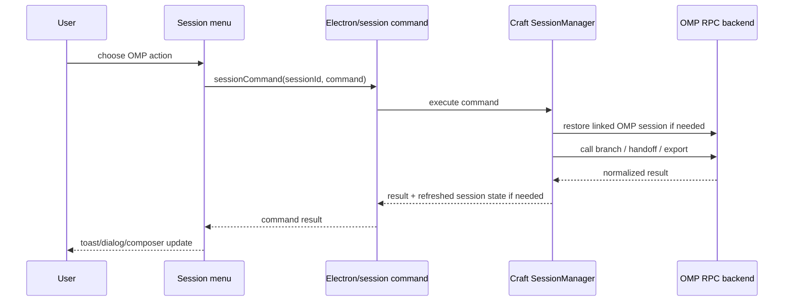

# OMP Session Actions Menu Design

Date: 2026-07-07

## Context

The first OMP parity batch made Craft preserve and restore OMP session continuity. The next missing OMP capability is exposing OMP's session-level actions from the desktop shell: branch, handoff, and HTML export.

The user selected the menu-based approach: add an OMP-specific action group to the existing session menus rather than creating a new panel or adding persistent chat-header buttons.

## Goals

- Surface OMP branch, handoff, and HTML export as product actions.
- Reuse the existing Craft session menu and compact menu patterns.
- Keep the behavior aligned with upstream Oh My Pi semantics.
- Avoid guessing when Craft messages and OMP entries cannot be safely mapped.
- Keep this batch narrow enough to implement and test independently.

## Non-goals

- Full parent/child branch tree visualization.
- Task-list, MCP, or memory synchronization beyond the state OMP already returns.
- Rich artifact management for handoff and export files.
- A new global OMP panel.
- Changing non-OMP session behavior.

## Chosen approach

Add an `OMP session` group to the existing session menu surfaces. This group appears only for sessions linked to an OMP backend session.

Actions:

1. `Create branch from here...`
2. `Handoff to new session...`
3. `Export HTML`

The same action implementation will be shared by `SessionMenu` and `CompactSessionMenu` through `useSessionMenuActions`, matching the existing pattern for share, copy path, and title refresh.

## Upstream behavior to preserve

### Branch

Upstream OMP branch selection targets a branchable user entry. After selection, OMP creates or switches to a branched session that contains the context before the selected user entry, and returns the selected text so the client can prefill the editor.

Craft should mirror that behavior:

- Ask OMP for branchable messages.
- Map each OMP branchable user entry to a Craft user message by ordinal position after session continuity reconciliation.
- Let the user choose one branch point.
- Call OMP branch with the selected OMP entry id.
- If OMP returns selected text and does not cancel, truncate the Craft session display state before the mapped Craft user message.
- Prefill the composer with the returned selected text.

If the OMP user-message list and Craft user-message list cannot be matched safely, the branch action fails with a clear continuity error. It must not guess.

### Handoff

Upstream OMP handoff generates a handoff document, starts a new OMP session with the previous session as parent, injects the handoff document as a custom context entry, and refreshes the agent message state.

Craft should treat handoff as a state-changing session action:

- Reject it while the Craft session is processing.
- Send optional custom instructions to OMP.
- After success, refresh the stored OMP session link and reload the visible session messages from OMP.
- Show a success toast.
- If OMP returns a saved path, expose open/reveal/copy affordances.

### HTML export

Upstream OMP export writes an HTML transcript and returns the output path.

Craft should:

- Call the OMP export action for the current OMP session.
- Show a success toast with the returned path.
- Offer open/reveal/copy affordances.
- Leave the active session state unchanged.

## Architecture

### Shared protocol

Extend the `SessionCommand` union with OMP-specific commands:

- `getOmpBranchOptions`
- `branchOmpSession`
- `handoffOmpSession`
- `exportOmpSessionHtml`

Return shapes should be explicit enough for renderer code to show good UX:

- Branch options: list of `{ entryId, craftMessageId, ordinal, textPreview }`.
- Branch result: `{ success, selectedText?, sessionLink?, error? }`.
- Handoff result: `{ success, savedPath?, error? }`.
- Export result: `{ success, outputPath?, error? }`.

### Server/session manager

`SessionManager` should expose narrow helper methods for OMP session actions, backed by the existing OMP agent/backend seam:

- Load or restore the OMP agent for the managed session.
- Reconcile messages before building branch options.
- Map branch options by user-message ordinal.
- Execute branch/handoff/export commands.
- Persist OMP session link changes.
- Emit the existing session/message update events after state-changing actions.

The OMP backend adapter should add RPC wrappers for:

- `get_branch_messages`
- `branch`
- `handoff`
- `export_html`

These wrappers should return normalized TypeScript objects and keep raw RPC details inside the backend layer.

### Renderer

`useSessionMenuActions` gains OMP action callbacks:

- `getOmpBranchOptions`
- `branchOmpSession`
- `handoffOmpSession`
- `exportOmpSessionHtml`

`SessionMenu` and `CompactSessionMenu` render the OMP action group only when the session metadata says the session is OMP-linked.

Branch should open a compact selection dialog/menu showing user-message previews. On success, the returned selected text is placed into the composer and the composer is focused.

Handoff should ask for optional custom instructions. Empty instructions are valid.

Export runs directly without an extra confirmation.

## Data flow

## Error handling

- Hide the action group for non-OMP sessions.
- Disable or fail actions while a session is processing.
- Treat OMP cancellation as a no-op with an informational toast.
- Treat branch mapping mismatch as a hard error with guidance to refresh/reconcile the session.
- Preserve current Craft state if OMP branch or handoff fails.
- Do not mutate Craft session state until OMP confirms a state-changing action succeeded.
- Show returned file paths for handoff/export, but tolerate missing paths.

## Testing

Focused tests should cover:

- New `SessionCommand` shapes typecheck through shared Electron types.
- OMP backend wrappers normalize branch, handoff, and export RPC responses.
- Branch option mapping succeeds when user-message ordinals match.
- Branch option mapping fails when Craft and OMP user-message counts or text previews diverge.
- Branch success truncates visible Craft messages before the selected user message and returns composer prefill text.
- Handoff refreshes the OMP session link and reloads messages.
- Export returns a path and does not mutate session messages.

Verification commands:

- `bun run typecheck:all`
- Focused OMP/session-manager tests touched by this batch.

## Implementation boundaries

This batch should stop once the three OMP session actions are available from the session menus, have safe state handling, and pass focused tests. Richer branch-tree UI and deeper OMP state parity should remain in the outstanding OMP parity backlog for later batches.
